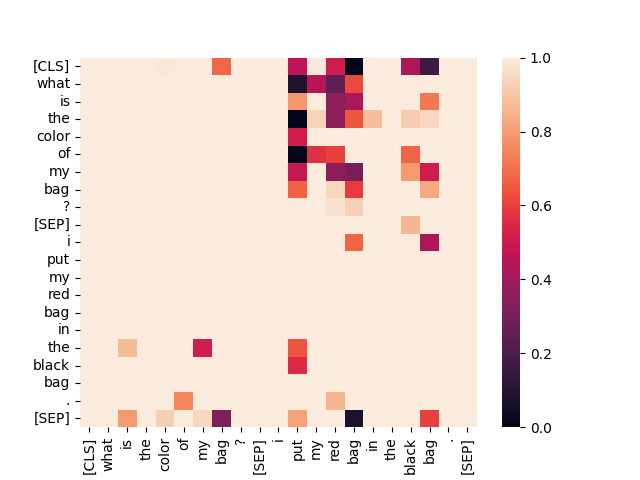

#  InA: Inhibition Adaption on Pre-Trained Language Models


[](https://opensource.org/licenses/MIT)

[](LICENSE)
[](https://arxiv.org/abs/2402.10107)


## What is Shunting Inhibition? 

Bellow image illustrates how shunting inhibition works, with its on (the red box) and off (the green box) states. When the gate of shunting inhibition is off, the signal transmission occurs across the joint, which can be influenced by shunting synapses. These shunting synapses play a crucial role in regulating neuronal function, and their activation can affect signal reception and transmission.

<div align="center">
  <figure>
    
  </figure>
</div>

## Why Shunting Inhibition is needed in Adaption Fine-tuning? 

Bellow is a practical example of InA when using it in the 𝐵𝐸𝑅𝑇-large model, which has been fine-tuned under question-answering datasets. Left panel explains the potential risk of LoRA, and right panel presents the visualization of the attention score on last second attention layer based on prior work Dai et al. (2019). The text is ’I put my red bag in the black bag.’, and the question is ’What is the colour of my bag?’, Therefore, the answer should be ’red’. There are two colours: red and black. Classical fine-tuning and adaption fine-tuning methods, such as LoRA, on downstream NLU tasks tend to choose the proper features from the entire ’redundant’ feature pool. This cannot essentially eliminate the influence of task-irrelevant words, for example, ’I’ and ’My’. After five epochs of InA fine-tuning, our inhibition vector can learn an incomplete intrinsic rank whose sole tail was eliminated by InA. Finally, activated by GeLU, which has a small negative tail, this incomplete intrinsic rank can provide the pre-trained weights with a small negative vector. Thus, these answer-irrelevant parts—’I’ and ’My’—in the intrinsic rank will be weakened or eliminated (see red stars in the right panel). We finally conclude that after InA fine-tuning, attention layers will pay less attention to such task-irrelevant information.

<div align="center">
  <figure>
    
  </figure>
</div>

**If only pay attention to the answer-relevant side (we have ignored the direction from the right to the left, as BERT based models have two directions.)**

Although LoRA and InA has the same answer, but from the average attention heatmap of all 24 layers shown bellow can find one solution to optimize LoRA (even one potential solution to overcome the **Hallucination of LLMs**):

**Shunting Inhibition mechanism has the obvious ability to weaken the answer-irrelevant passing information, as well as other attention scores**

<font face="Arial Black" size="3">1</font>

|Layer|Fully FT:|LoRA (no-inhibition):|InA (inhibiiton 10%):|InA (inhibiiton 30%):|InA (inhibiiton 90%):| 
|  :-:   |  :-:   | :-:  |   :-:  |   :-:  |   :-:  |
|1|  |   |   |   |   |
|2|  |   |   |   |   |
|3|  |   |   |   |   |
|4|  |   |   |   |   |
|21|  |   |   |   |   |
|22|  |   |   |   |   |
|23|  |   |   |   |   |
|24|  |   |   |   |   |


## How does Shunting Inhibition effect LoRA?

InA also inserts trainable inhibition matrices into transformer layers to approximate the weight updates. By using a low-rank decomposition $W_0 + \Delta = W_0 + W_{down}$, where $W_{down} \in {R^{d\times{r}}}$, $W_{up} \in {R^{r\times{k}}}$, $Th \in {R^{M\times{1}}}$, InA updates the $Query$ and $Key$ projection matrices ($W_{q},W_{k}$) in the multi-head attention sub-layer. For the specific input $H$, InA modifies the projection output $H_{o}$ as:

$$H_{o} \leftarrow H_{o}+s \cdot f(HW_{down}-Th)W_{up},$$

where $s \in \{0, 1\}$ is a tunable scalar hyperparameter, and $Th$ is the threshold. 

**Notation.** We denote input hidden vectors as $H \in {R^{M\times{d}}}$ and the output of self-attention as ${H}_{o} \in {R^{M \times{d}}}$. $W_{k}, W_{q}, W_{v} \in {R^{d\times{d}}}$ are the projection matrices.

**Motivation.**  The motivation of InA on Transformer is to assemble a flexible gate with an adjustable inhibition vector to fine-tune downstream tasks. In addition, it should be able to automatically learn to rarefy tense features without sparsity settings. Under transfer learning, pre-trained language models can provide features for downstream tasks. The inhibition vector with a gate mechanism can learn to adjust and inhibit the provided features, and it finally makes tunable weights fit into a specific downstream task by fine-tuning. We formulate the linear InA layer as:

$$I_{k}=f(HW_{k\_down}-Th_{k})W_{k\_up},$$
$$I_{q}=f(HW_{q\_down}-Th_{q})W_{q\_up},$$

where $I_{k} \in {R^{M\times{d}}}$ and $I_{q} \in {R^{M\times{d}}}$, respectively, is the $Inhibition$ matrix in $Key$ side and $Query$ side; $f$ is the activation function; $Th_{k} \in {R^{M\times{1}}}$ is the product of $\max(HW_{k\__down}) \times Inh_{p}$ in terms of the column-wise maximization and $Th_{q} \in {R^{M\times{1}}}$ is the product of $\max(HW_{q\_down}) \times Inh_{p}$ in terms of the column-wise maximization. 


This repository is a tutorial for finetuning LLMs with InA on Alpaca datasets! So here's how to reproduce:

## Installation

1. Install requirements

```bash
$ pip install -r requirements.txt
```

2. Install PyTorch at compatible version with CUDA

```bash
$ pip install torch==1.13.1+cu116 torchvision==0.14.1+cu116 torchaudio==0.13.1+cu116 --extra-index-url https://download.pytorch.org/whl/cu116
```


## Finetune on Benchmarks

Reference finetune method provide by [tloen/alpaca-lora](https://github.com/tloen/alpaca-lora) 

1. Run on 1 GPU with Colab: https://colab.research.google.com/drive/1QvtrJpikkkNKSbwwG766SIGbBw2TQRd5?usp=sharing

  - `LLaMA`
    ```bash
    $ cd finetune/
    $ python finetune.py --base_model decapoda-research/llama-7b-hf --data_dir ../data/alpaca-en-zh.json --output_dir ../finetuned/llama-7b-hf_alpaca-en-zh --threshold_ratio_inhi 0.3 --lora_target_modules '["q_proj", "v_proj"]'
    ```
  
  - `BLOOM`
    ```bash
    $ cd finetune/
    $ python finetune.py --base_model bigscience/bloomz-7b1-mt --data_dir ../data/alpaca-en-zh.json --output_dir ../finetuned/bloomz-7b1-mt_alpaca-en-zh --threshold_ratio_inhi 0.3 --lora_target_modules '["query_key_value"]'
    ```

2. Use `torchrun` for distributed training on Multi-GPUs

  - `LLaMA`
    ```bash
    $ cd finetune/
    $ torchrun --standalone --nnodes=1 --nproc_per_node=4 finetune.py --base_model decapoda-research/llama-7b-hf --data_dir ../data/alpaca-en-zh.json --output_dir ../finetuned/llama-7b-hf_alpaca-en-zh --threshold_ratio_inhi 0.3 --lora_target_modules '["q_proj", "v_proj"]'
    ```

  - `BLOOM`
    ```bash
    $ cd finetune/
    $ torchrun --standalone --nnodes=1 --nproc_per_node=4 finetune.py --base_model bigscience/bloomz-7b1-mt --data_dir ../data/alpaca-en-zh.json --output_dir ../finetuned/bloomz-7b1-mt_alpaca-en-zh --threshold_ratio_inhi 0.3 --lora_target_modules '["query_key_value"]'
    ```


### Finetune on Domain Tasks

I've collected different domain tasks in my repository: [instruction-finetune-datasets](https://github.com/ChengKang520/psychotherapy-assistant_instruction)

Welcome cooperations! Please contact me at: `kangkangsome@gmail.com`. I'd like to try tasks from different domains such as investment, fraud, e-commerce, law, healthcare, ...


## Model Serving
To serve your own model service through API & simple website UI!

1. Model API

```bash
cd serve/
python api.py
```

2. demo UI

```bash
cd serve/
python ui.py
```


```
@article{kang4551993ina,
  title={InA: Inhibition Adaption on Pre-Trained Language Models},
  author={Kang, Cheng and Prokop, Jindich and Tong, Lei and Zhou, Huiyu and Hu, Yong and Novak, Daniel},
  journal={Available at SSRN 4551993}
}
```

