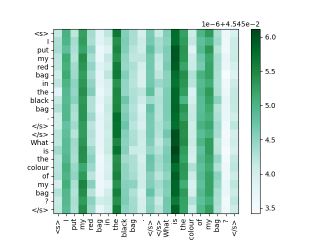
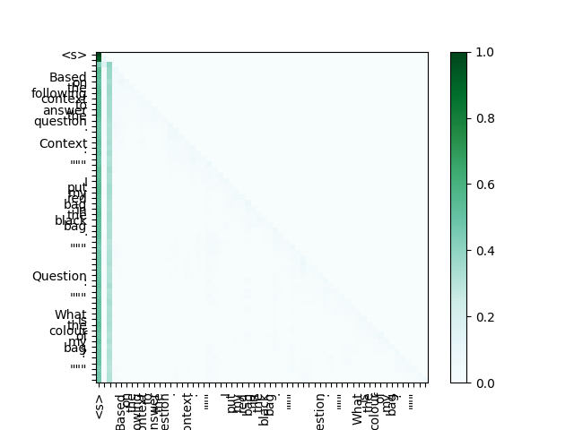

#  InA: Inhibition Adaption on Pre-Trained Language Models


This repository contains the code necessary to reproduce Shunting Inhibition on LoRA, the shunting inhibition mechanism that controls passed information from previous layers introduced in the [paper](https://papers.ssrn.com/sol3/papers.cfm?abstract_id=4551993):


## Installation

1. Install requirements

```bash
$ pip install -r requirements.txt
$ pip install -e peft-0.10.0/
```


## Visualization of Average Attention Heatmap 

Firstly, we should finetune the RoBERTa-large on SquAD v2.0 using different inhibition levels. 


- `RoBERTa-large`
    ```bash
    $ cd LoRA-LM/
    $ sbatch squad_RoBERTa.batch
    ```
<font face="Arial Black" size="3">1</font>

|Layer|Fully FT:|LoRA (no-inhibition):|InA (inhibiiton 10%):|InA (inhibiiton 30%):|InA (inhibiiton 90%):| 
|  :-:   |  :-:   | :-:  |   :-:  |   :-:  |   :-:  |
|1|  |   |   |   |   |
|2|  |   |   |   |   |
|3|  |   |   |   |   |
|4|  |   |   |   |   |
|21|  |   |   |   |   |
|22|  |   |   |   |   |
|23|  |   |   |   |   |
|24|  |   |   |   |   |


- `Llama2-7B` needs 2 GPUs
    ```bash
    $ cd LoRA-LM/
    $ sbatch squad_llama-2.batch
    ```
<font face="Arial Black" size="3">1</font>

|Layer|Fully FT:|LoRA (no-inhibition):|InA (inhibiiton 10%):|InA (inhibiiton 30%):|InA (inhibiiton 90%):| 
|  :-:   |  :-:   | :-:  |   :-:  |   :-:  |   :-:  |
|1|  |   |   |   |   |
|2|  |   |   |   |   |
|3|  |   |   |   |   |
|4|  |   |   |   |   |
|29|  |   |   |   |   |
|30|  |   |   |   |   |
|31|  |   |   |   |   |
|32|  |   |   |   |   |


